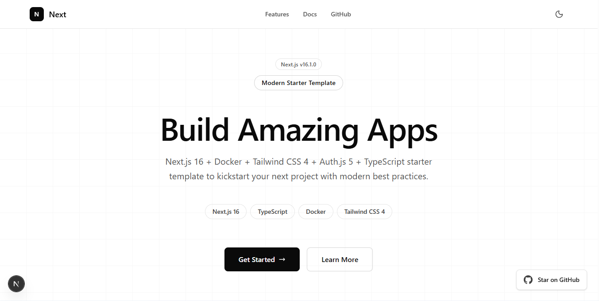

<h1 align="center">
Next.js 16 Starter with PNPM, Tailwind v4+, and Docker
</h1>
<p align="center">
A batteries-included starter for building production-ready Next.js apps with App Router, PNPM, Tailwind v4+, TypeScript, and a multi-stage Docker setup.
</p>



## 📖 Overview

This template gives you a minimal but opinionated foundation so you can focus on building, not configuring. It includes a clean project structure, built-in LLM-safe API example, production Dockerfile, and CI setup with pnpm caching. Deploy anywhere: Vercel, Fly.io, Render, or any container registry.

---

## 🚀 Features

- **Next.js 16.1.0** with App Router
- **Next-Auth v5** complete open source authentication solution
- **TypeScript** preconfigured
- **PNPM** workspace-friendly setup
- **Tailwind CSS v4+** with modern defaults
- **LLM-safe API example** (sanitized inputs + safe output handling)
- **Multi-stage Production Dockerfile** (tiny, fast, secure)
- **CI workflow** with pnpm caching (GitHub Actions ready)
- **Opinionated minimal file structure** for maximum clarity
- **Ready for Vercel or containerized deployment**

---

## 🧩 Prerequisites

Make sure you have:

- **Node.js ≥ 20**
- **PNPM ≥ 9**
- **Docker (optional)** for production builds

---

## 🛠️ Installation

```bash
pnpm i
```

## ▶️ Development

```bash
pnpm dev
```

The app starts at **[http://localhost:3000](http://localhost:3000)**.

---

## 🐳 Production with Docker

Build the production image:

```bash
docker build -t next-starter .
```

Run the app:

```bash
docker run -p 3000:3000 next-starter
```

---

## 📦 Environment Variables

Create `.env.local`:

```bash
# Example
NEXT_PUBLIC_SITE_NAME="Next.js Starter"
```

---

## 📤 Deployment

### **Vercel**

You can deploy immediately:

```bash
vercel deploy
```

### **Container Registry**

Push to any registry (GHCR, DockerHub, AWS ECR, etc.):

```bash
docker push <registry>/<namespace>/<name>
```

---

## 🤝 Contributing

PRs, issues, and suggestions are welcome!
Feel free to fork and adapt this starter for your own needs.

---

## 📄 License

MIT License.
